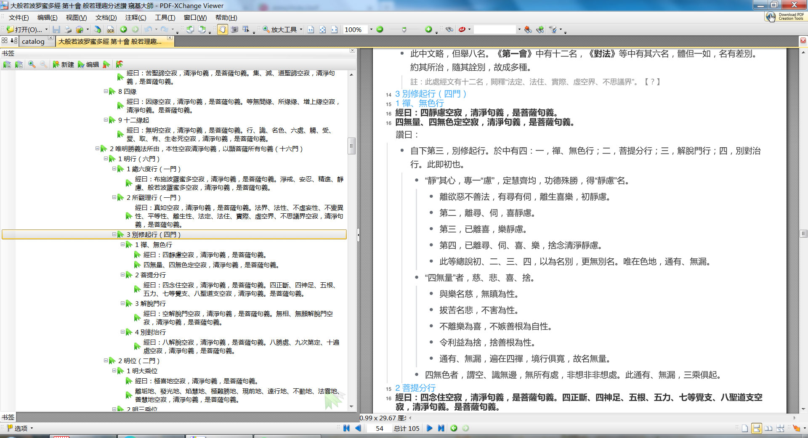

# mubu2pdf
Convert mubu.com outline html to pdf, with up to 108 heading levels. 

## 简介
这个 Python 脚本用来把幕布（mubu.com）导出的 html 文件，转换为 PDF 文档。

这不是一般的 PDF 文档，而是支持多达 108 级标题的 PDF 文档。



推荐使用 PDF-XChange Viewer 来阅读生成的 PDF ，它可以支持无限级的标题。

## 安装

这个工具主要使用了两个 Python 库，需要使用 pip 预先安装：

1. [lxml](https://github.com/lxml/lxml)

2. [weasyprint](https://github.com/Kozea/WeasyPrint)

特别是 weasyprint 这个库安装比较麻烦，请自己去官网搜索安装文档。

## 使用方法

1. 从幕布（mubu.com）把你的大纲文件导出为 html ，放到 mubu/ 目录下；

2. 然后执行脚本： 

```
python parse_html.py
```

它就会自动查找 mubu/ 目录下所有的 html 文件，把它们统统转换为 pdf ，放置在 pdf/ 目录下。
html/ 目录用来放置生成的中间文件。

